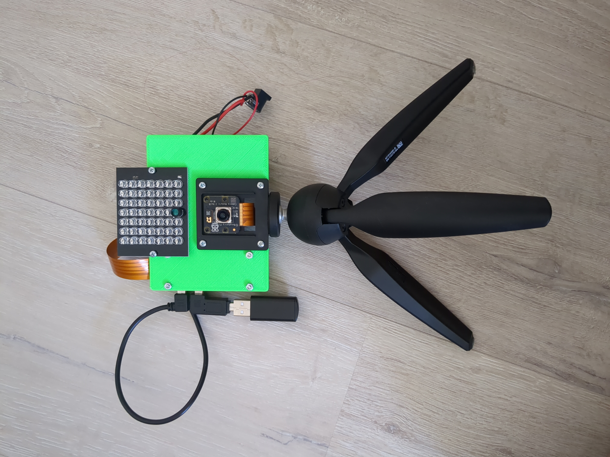
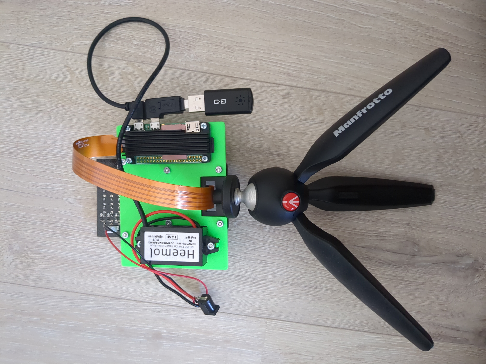
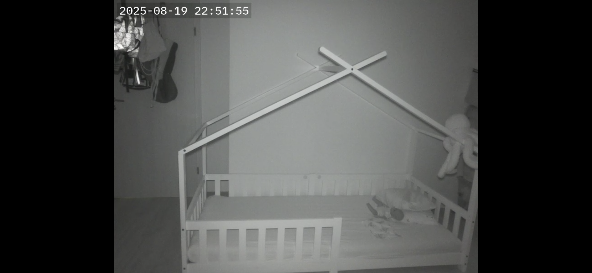

# KISS Baby Monitor
The goal of this project is to create a simple baby monitor, which is affordable, easy to build, easy to repair and easy to adjust.  
The name refers to the [KISS principle](https://en.wikipedia.org/wiki/KISS_principle): "Keep it simple, stupid!"  
There are alternative projects out there (see section [Other Open Source Baby Monitor Solutions](#other-open-source-baby-monitor-solutions)), which are more complex. My goal is to create a very simple solution (just video and audio streaming, no AI or any bloat).

This project is based on the [Raspberry Pi Zero 2 W](https://www.raspberrypi.com/products/raspberry-pi-zero-2-w/) and the software [MediaMTX](https://github.com/bluenviron/mediamtx).

## Hardware
- [Raspberry Pi Zero 2 W](https://www.berrybase.de/raspberry-pi-zero-2-w)
- [Aluminium Heat Sink for Raspberry Pi Zero 2 W](https://www.berrybase.de/waveshare-aluminiumkuehlkoerper-fuer-raspberry-pi-zero-zero-2-w)
- [Raspberry Pi Camera Module 3 Wide NoIR](https://www.berrybase.de/raspberry-pi-camera-module-3-wide-noir-12mp)
- [Raspberry Pi Camera Cable, Standard - Mini](https://www.berrybase.de/raspberry-pi-camera-cable-standard-mini-300mm)
- [Raspberry Pi Camera Mount](https://www.berrybase.de/mount-fuer-raspberry-pi-kameras-1-4-stativgewinde-inkl.-mini-stativ)
- [Manfrotto MTPIXIMII-B, PIXI Mini-Stativ](https://amzn.eu/d/8S8Y6OI)
- [USB Microphone](https://amzn.eu/d/gOqTDRu)
- [Micro USB Male to USB 2.0 Female Adapter](https://amzn.eu/d/7YPl5YC)
- [90 Degree Angled Micro USB 2.0 Male to Female Adapter](https://amzn.eu/d/enbnpMW)
- [12V to 5V Micro USB Adapter](https://amzn.eu/d/j3NnDJE)
- [M3 Thread Insert](https://amzn.eu/d/e58Oaoh)
- [940NM IR LEDs](https://de.aliexpress.com/item/32871966500.html)
- 12V 2,5A Power Supply

For the proof of concept I created a [3D printed Mount Adapter](kiss-baby-monitor-mount.stl). This adapter is attached to the Raspberry Pi Camera Mount with M2.5 screws. I drilled 4 holes into the Raspberry Pi Camera Mount. The equipment is also attached to the 3D printed Mount with M2.5 and M3 screws. The M2.5 screws are all through hole with nuts, the M3 screws are attached with M3 Thread Inserts.

PoC Front                               |  PoC Back
:--------------------------------------:|:--------------------------------------:
   |  

## Operating System and Software
As operating system [Raspberry Pi OS Lite (64-bit)](https://www.raspberrypi.com/software/operating-systems/) is used. As software to capture the video and sound and to stream it [MediaMTX](https://github.com/bluenviron/mediamtx) is used.

### Installation
Install [Raspberry Pi OS Lite (64-bit)](https://www.raspberrypi.com/software/operating-systems/). I used the Raspberry Pi Imager to configure Wi-Fi and SSH already at this step.

Disable unneeded services to have a smooth stream:

```sh
sudo systemctl disable bluetooth
sudo systemctl disable triggerhappy
sudo systemctl disable apt-daily.timer
sudo systemctl disable apt-daily-upgrade.timer
```
> [!CAUTION]
> With the commands above the automatic updates of the operating systems are disabled. Make sure to update the operating system once in a while manually when the device is not used as a baby monitor.

Create a systemd device unit to make sure the MediaMTX service is started after USB is initiated (for the USB Microphone to work):
```sh
sudo tee /etc/udev/rules.d/20-usb-bus.rules >/dev/null << EOF
KERNEL=="usb[1-2]", TAG+="systemd"
EOF
```
> [!NOTE]
> Source: https://superuser.com/a/1398400

Add dependencies for audio. For details see the [MediaMTX README](https://github.com/bluenviron/mediamtx?tab=readme-ov-file#adding-audio).

Download [MediaMTX release files](https://github.com/bluenviron/mediamtx/releases). Make sure to use the `linux_arm64` version.

Extract the downloaded archive:
```sh
tar -xvzf mediamtx_vX.XX.X_linux_arm64.tar.gz
```

Create a systemd service. For details see the [MediaMTX README](https://github.com/bluenviron/mediamtx?tab=readme-ov-file#linux).  
Add the following line to the end of the `[UNIT]` section of the systemd service file:  
`After=dev-bus-usb-001-001.device`

Optional: Adjust the MediaMTX configuration file (`/usr/local/etc/mediamtx.yml`). Example of my configuration file:
```
paths:
  cam:
    source: rpiCamera
    rpiCameraWidth: 800
    rpiCameraHeight: 600
    rpiCameraFPS: 10
    rpiCameraTextOverlayEnable: true
    rpiCameraTextOverlay: '%Y-%m-%d %H:%M:%S'
    rpiCameraBitrate: 1000000

  cam_with_audio:
    runOnInit: >
      gst-launch-1.0
      rtspclientsink name=s location=rtsp://localhost:$RTSP_PORT/cam_with_audio
      rtspsrc location=rtsp://127.0.0.1:$RTSP_PORT/cam latency=0 ! rtph264depay ! s.
      alsasrc device=plughw:CARD=Device,DEV=0 ! opusenc bitrate=16000 ! s.
    runOnInitRestart: yes
```

## Usage
The power supply of the baby monitor just needs to be plugged in.

As a parent device (to view the stream) I am using an old Android phone with the [VLC app](https://f-droid.org/packages/org.videolan.vlc/). The stream can be opened with the following URL:  
`rtsp://IP_ADDRESS_OF_RASPBERRY_PI:8554/cam_with_audio`

## Demonstration of Quality
The quality is very good, given the fact that it's pitch black inside the room.



## Possible future improvements
If I find time, I will work on the following topics related to this project:
- [ ] 3D-printed box/enclosure
- [ ] Script for automatic installation
- [ ] Parent Unit based on a Raspberry Pi
- [ ] Improve Android-based parent unit (develop an own app - maybe based on [rtsp-client-android](https://github.com/alexeyvasilyev/rtsp-client-android))

Goals to achieve with the two parent unit topics are typical baby monitor stuff, e.g.:
- automatic reconnection if connection gets lost
- alarm sound while connection is lost

## License
The 3D printable file is released under the [GNU GPLv3 License](LICENSE).

## Other Open Source Baby Monitor Solutions
- [Open Baby Monitor](https://github.com/lars-frogner/OpenBabyMonitor)
- [Fruitnanny](https://github.com/ivadim/fruitnanny)
